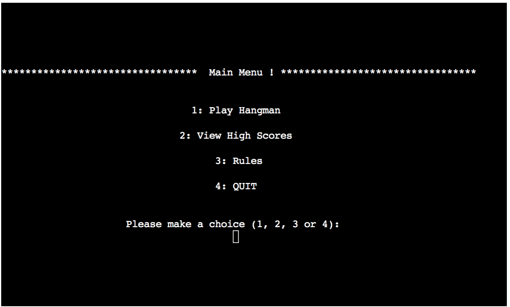

# **Hangman**

[The Live version of this project is here!](https://dkitley-hangman.herokuapp.com)

  Hangman is a Python terminal game, which runs in the Code Institute mock terminal on Heroku with the constraints of a window size of 80 by 24 characters.

## Table Of Contents

- [**Hangman**](#hangman)
  - [Table Of Contents](#table-of-contents)
  - [Project Overview](#project-overview)
    - [Site User Goals](#site-user-goals)
    - [Site Owner Goals](#site-owner-goals)
  - [Game Play Features](#game-play-features)
    - [The Welcome Page](#the-welcome-page)
    - [Game Play](#game-play)
    - [High Scores](#high-scores)
    - [The Rules](#the-rules)
    - [Exit](#exit)
  - [ASCCI ART](#ascci-art)
  - [Game Flow](#game-flow)
  - [Testing and Bugs](#testing-and-bugs)
    - [Features Left to Implement](#features-left-to-implement)
    - [Testing](#testing)
  - [Input Validation](#input-validation)
    - [Menu Input Validation](#menu-input-validation)
    - [Game Play Input Validation](#game-play-input-validation)
  - [PEP8](#pep8)
  - [Bugs](#bugs)
  - [Deployment](#deployment)
  - [Credits](#credits)
  - [Special Thanks](#special-thanks)

## Project Overview

  This Hangman game is a Python terminal game, designed to run in the Code Institues mock terminal on Heroku.
  Users try to guess the letters within a word randomly fetched from [[Random Word - API](https://random-word-api.herokuapp.com/)].
  If the user is incorrect the Hangman state is redrawn in the game window adding additional limbs untill either the word is guessed or the figure is hung in the way of the traditional Hangman game.
  The game asks for a username durnig the game play and updates the scoreboard when the game is completed.

### Site User Goals

- I want to be able to play a simple online game.
- I want to be able to see which words or letters I have previously guessed.
- I want to see a visual representation of my lives used during the game play.
- I want to be able to replay the game without repeating the same word each time.
- I want to be able to view the high scores table of previously saved scores.

### Site Owner Goals

- I want to provide a stimulating game
- I want to enable the user to easily navigate the game without encountering any difficulty.
- I want the user to return and replay the quiz.
- I want the user high scores to be recorded to give the incentive to return and replay the game to improve their score.

## Game Play Features

### The Welcome Page

- The welcome page displays some an ASCII Art message welcoming the user to the game before displaying a menu.
- The Menu contains the options to:
  - Play the game.
  - View the previous high scores.
  - View the rules.
  - Exit the game to the terminal.
  
  

### Game Play

  The player is initially asked for their name, this is used for the highscore table and also welcomes them on the next page.
  A word randomly fetched from [[Random Word - API](https://random-word-api.herokuapp.com/)] and a game board is drawn. With a message saying how many letters are in the word, the empty gallows, underscores representing the letters and a message asging for the player to guess a letter or word.
  
  If the user enters an invalid responce ther are instructed the input was invalid and asked to input a revised responce.
  If a guess is a valid guess and not in the word a message tells them the guess was incorrect and after 1 second the game board is redrawn with the players previous guesses listed and an item is drawn under the gallows. There are 8 lives, as these are used an item is added to the gallows:

    1. A rope is drawn
    2. A head
    3. A body
    4. A left arm
    5. A right arm
    6. A left leg
    7. A right leg
    8. The person is hung
  
  If a guess is a valid guess and is in the word a message tells them the guess was correct and after 1 second the game board is redrawn with the players previous guesses listed and the correct letter replaces the underscore representing the letter in the word to guess beneath the gallows.
  

### High Scores

  This section has a table drawn from the previous game play. The highscores are stored in a Google Spread sheet and are automatically updated at the end of a sucessful word guess using the player name and the lives left.

  
  
### The Rules

  This section displayes the rules for the game and waits for the user to press enter before retuning to the main menu.

### Exit

  The player can chhoose to exit to the terminal after game play if required.

## ASCCI ART

  I used this site [ASCCI ART](https://patorjk.com) to create the ASCCI art used through out the site, this all needed to be amended to add the additional \'s and re-aligned to fit the terminal alloted space.
  This art is used as menu headers for The Rules, Highscores. Commiserations, Congratulations, Welcome and Lets Play Messages.

## Game Flow

  
  I used [Lucid Chart](https://www.lucidchart.com/) to sketch out the flow of the game, as a guide for the coding process.

## Testing and Bugs

### Features Left to Implement

- Difficulty Levels. Retrieving only words of a certain length according to the Player selected difficultly level.
- Increase the gap between the underscores representing the blank word. At present, in some resolutions these underscores can appear to be joined together without any gap.

### Testing

  I have manually tested the site in my local terminal and in the Code Institute Heroku terminal.

## Input Validation

### Menu Input Validation

If the player inputs an invalid input on the menu input, the player is advised this is an invalid input and is asked to make a revised choice.
  

### Game Play Input Validation

If the player inputs an invalid input during game play, the player is advised this is an invalid input via a message that is dispalyed for 3 seconds, before the screen is refreshed.
  

## PEP8

  Passed the code through a PEP8 linter and confirmed there are no problems [PEP8 online validator](http://pep8online.com/)

## Bugs

 It was noted during creating the screen shots that the highscores were listed alphabetically by the Player Name rather than the Scores. This bug was added when the highscores were rearranged previously by Score, Player Name, and Guessed Word. This was rearranged with the Score first then Player Name and Guessed Word. The sort command was left sorting by the 2nd column instead of being updated.

## Deployment

  I deployed the project code to GitHub and pushed it to Heroku as an [Heroku Terminal App](https://dkitley-hangman.herokuapp.com/).

  The steps to deployment are:

  1. Fork or clone this repository to your own GitHub repository.
  2. Create a Google Spreadsheet
  3. On ([Google Cloud Platform](https://console.cloud.google.com/?pli=1)) Add the Services for Google Drive and create a Credential Key, save the key data as a JSON file for use in the Heroku app. Then add the service for Google Sheets.
  4. Create a new [Heroku App](https://id.heroku.com/login/).
  5. Set the buildbacks to Pyhton and NodeJS in that order.
  6. Add Config Var keys  
    CREDS -  Your Credentials data from Google
    PORT - 8000
    KEY - VALUE
  7. Link the Heroku app to repository
  8. Click on Deploy

## Credits

- Code Institute for the deployment terminal
- Google
- YouTube videos
- [ASCCI ART](https://patorjk.com")
  
## Special Thanks

  Special thanks to my mentor Simen Daehlin for the patience, help and pointers he provided along the way.

  Well thanks for reading all the way to the bottom, and for visiting this [my third project](https://dkitley-hangman.herokuapp.com) for my [Code Institute](https://codeinstitute.net/) Diploma in Software Development (E-commerce Applications)

[The Live version of this project can be found here.](https://dkitley-hangman.herokuapp.com)
